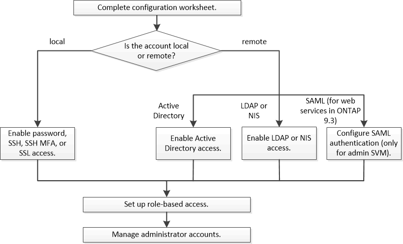

= 系統管理員驗證和RBAC工作流程
:allow-uri-read: 
:icons: font
:imagesdir: ../media/

[role="lead"]
您可以啟用本機系統管理員帳戶或遠端系統管理員帳戶的驗證。本機帳戶的帳戶資訊位於儲存系統上、遠端帳戶的帳戶資訊則位於其他位置。每個帳戶都可以擁有預先定義的角色或自訂角色。

您可以使用下列驗證類型、讓本機系統管理員帳戶存取管理儲存虛擬機器（SVM）或資料SVM：

* 密碼
* SSH公開金鑰
* SSL 憑證
* SSH多因素驗證（MFA）
+
從支援使用密碼和公開金鑰的驗證功能、從ONTAP 功能表9.3開始。

您可以使用下列驗證類型、讓遠端系統管理員帳戶存取管理SVM或資料SVM：

* Active Directory
* SAML驗證（僅適用於管理SVM）
+
從ONTAP Sf9.3開始、安全聲明標記語言（SAML）驗證可用於使用下列任一Web服務存取管理SVM：服務處理器基礎架構、ONTAP Sf0 API或系統管理員。

* 從ONTAP 版本9.4開始、SSH MFA可用於LDAP或NIS伺服器上的遠端使用者。支援使用nsswitch和公開金鑰進行驗證。

