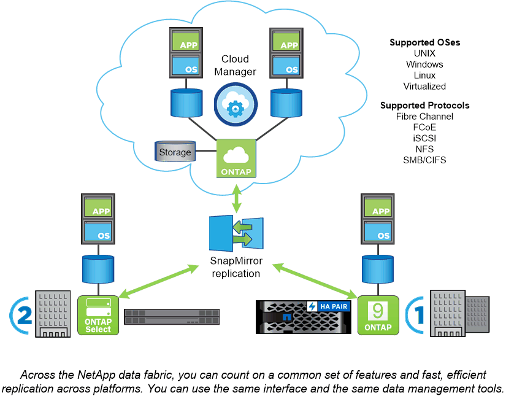

= 支援各種平台ONTAP
:allow-uri-read: 
:icons: font
:imagesdir: ../media/

[role="lead"]
支援以區塊或檔案存取傳輸協定讀取和寫入資料的應用程式、以及從高速Flash、低價旋轉媒體到雲端型物件儲存等儲存組態、均可獲得統一化的資料管理軟體。ONTAP

執行功能可在NetApp設計的功能完善的功能、例如在市售硬體（例如、英文）上、以及私有、公有或混合雲（NetApp私有儲存設備或是英文版）上執行。ONTAP FAS AFF ONTAP Select Cloud Volumes ONTAP專業實作提供同級最佳的融合式基礎架構FlexPod （「Datacenter」）、並可存取第三方儲存陣列FlexArray （「整合式虛擬化」）。

這些實作組合構成_NetApp資料架構的基本架構、_採用通用的軟體定義方法來進行資料管理、以及跨平台快速高效地複寫。

.關於 FlexPod 資料中心和 FlexArray 虛擬化
雖然NetApp Data Fabric的圖例中並未顯示FlexPod 、但重點FlexArray 在於實現「資料中心」和「虛擬化」ONTAP ：

* 支援業界最佳的儲存、網路及運算元件、以靈活的架構整合企業工作負載。FlexPod其融合式基礎架構可加速業務關鍵應用程式與雲端型資料中心基礎架構的部署。
* 支援第三方與NetApp E系列儲存陣列的前端產品、提供統一的功能組合、並簡化資料管理。FlexArray這個系統看似任何其他的不一樣系統、提供所有相同的功能。FlexArray ONTAP

