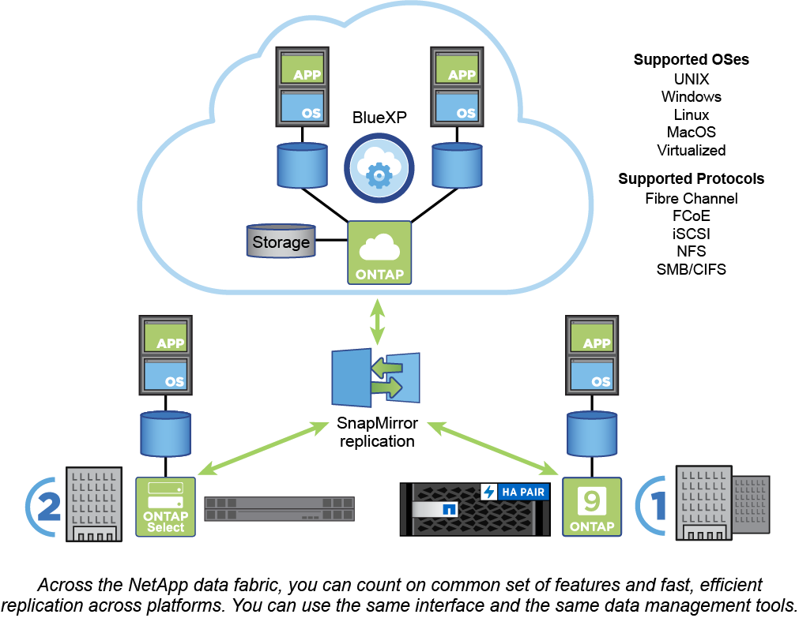

= ONTAP 平台
:allow-uri-read: 
:icons: font
:imagesdir: ../media/

[role="lead"]
支援以區塊或檔案存取傳輸協定讀取和寫入資料的應用程式、以及從高速Flash、低價旋轉媒體到雲端型物件儲存等儲存組態、均可獲得統一化的資料管理軟體。ONTAP

ONTAP 實作可在 NetApp 設計的 FAS 、 AFF A 系列和 C 系列、 All SAN Flash Array ASA 平台、以及市售硬體（ ONTAP Select ）、私有雲、公有雲或混合雲（ Cloud Volumes ONTAP ）中執行。專業實作提供同級最佳的融合式基礎架構（ FlexPod 資料中心）。

這些實作組合構成_NetApp資料架構的基本架構、_採用通用的軟體定義方法來進行資料管理、以及跨平台快速高效地複寫。

