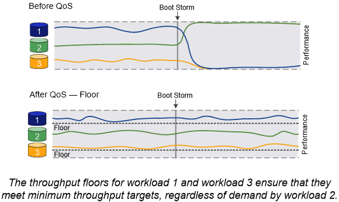

= 負載平衡
:allow-uri-read: 
:icons: font
:imagesdir: ../media/

[role="lead"]
當節點上的工作量超過可用資源時、工作負載的效能會開始受到延遲的影響。您可以增加可用資源（升級磁碟或CPU）、或減少負載（視需要將磁碟區或LUN移至不同節點）、來管理過載的節點。

您也可以使用ONTAP SURF_storage Quality of Service（QoS）_來保證關鍵工作負載的效能不會因競爭工作負載而降級：

* 您可以在競爭的工作負載上設定QoS處理量上限、以限制其對系統資源的影響（QoS上限）。
* 您可以針對關鍵工作負載設定QoS處理量_flo__、確保無論競爭工作負載的需求為何、它都能達到最低處理量目標（QoS下限）。
* 您可以為相同的工作負載設定QoS上限和樓層。

== 處理量上限

處理量上限會將工作負載的處理量限制為最大IOPS或MB/s在下圖中、工作負載2的處理量上限可確保其不會「受到欺凌」的工作負載1和3。

_原則群組_定義一或多個工作負載的處理量上限。工作負載代表_storage物件的I/O作業：_磁碟區、檔案或LUN、或SVM中的所有磁碟區、檔案或LUN。您可以在建立原則群組時指定上限、也可以等到監控工作負載之後再指定上限。

[NOTE]
====
工作負載的處理量可能超過指定上限10%、尤其是當工作負載處理量發生快速變化時。處理突發的上限可能超過50%。

====
image::../media/qos-ceiling-concepts.gif[QoS上限概念]

== 處理量層

處理量層級可確保工作負載的處理量不會低於最低IOPS數。在下圖中、工作負載1和工作負載3的處理量層級可確保它們符合最低處理量目標、無論工作負載2的需求為何。

[TIP]
====
如範例所示、處理量上限會直接調節處理量。處理量最低層會間接調節處理量、將已設定最低層的工作負載設為優先順序。

====
工作負載代表磁碟區、LUN或ONTAP 從檔名不含資訊的9.3開始的I/O作業。定義處理量層的原則群組無法套用至SVM。您可以在建立原則群組時指定樓層、也可以等到監控工作負載之後再指定樓層。

[NOTE]
====
如果節點或Aggregate上的效能容量（保留空間）不足、或是在執行「Volume Move toger-cover」（Volume Move tog-tover）等關鍵作業時、工作負載的處理量可能會低於指定樓層。即使有足夠的可用容量且未執行關鍵作業、工作負載的處理量仍可能低於指定樓層達5%。

====

== 調適性QoS

通常、您指派給儲存物件的原則群組值會固定。當儲存物件大小變更時、您需要手動變更值。例如、增加磁碟區上使用的空間量、通常需要為磁碟區指定的處理量上限相應增加。

_Adaptive QoS_會自動將原則群組值調整為工作負載大小、並隨著工作負載大小的變更、維持IOPS與TBs的比率。當您在大型部署中管理數百或數千個工作負載時、這是相當大的優勢。

您通常會使用調適性QoS來調整處理量上限、但也可以使用它來管理處理量層（當工作負載大小增加時）。工作負載大小是以儲存物件的已配置空間或儲存物件所使用的空間表示。

[NOTE]
====
在ONTAP 更新版本的更新版本中、可在處理量層使用已用的空間。不支援ONTAP 使用於效能不符合更新版本的資料層。

====
* _allocated space_原則會根據儲存物件的名義大小、維持IOPS/TB|GB比率。如果比率為100 IOPS/GB、則150 GB的磁碟區只要磁碟區維持該大小、就會有15,000 IOPS的處理量上限。如果磁碟區大小調整為300 GB、調適性QoS會將處理量上限調整為30、000 IOPS。
* _used space_原則（預設值）會根據儲存效率前的實際資料量、維持IOPS/TB|GB比率。如果比率為100 IOPS/GB、則儲存100 GB資料的150 GB磁碟區的處理量上限為10、000 IOPS。隨著使用空間量的變化、調適性QoS會根據比率調整處理量上限。

