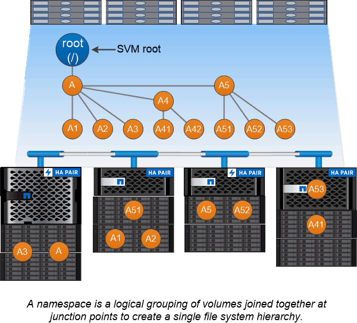

= 命名空間和交會點
:allow-uri-read: 
:icons: font
:imagesdir: ../media/

[role="lead"]
NAS _namespacity_是一個邏輯群組、集合在_交會點_、以建立單一檔案系統階層架構。具有足夠權限的用戶端可存取命名空間中的檔案、而無需指定檔案在儲存設備中的位置。未分段的磁碟區可位於叢集中的任何位置。

NAS用戶端不會掛載每個包含感興趣檔案的磁碟區、而是掛載NFS _EX出口_或存取SMB共享區。_匯出或共用區代表整個命名空間或命名空間內的中繼位置。用戶端只會存取裝載於其存取點下方的磁碟區。

您可以視需要將磁碟區新增至命名空間。您可以直接在父磁碟區交會下方或磁碟區內的目錄上建立交會點。磁碟區的「vol3」連接路徑可能是「/vol1/vol2/vol3」或「/vol1/dir2/vol3」、甚至是「/dir1/dir2/vol3」。路徑稱為_junction路徑。_

每個SVM都有一個獨特的命名空間。SVM根磁碟區是命名空間階層架構的起點。

[NOTE]
====
為了確保資料在節點中斷或容錯移轉的情況下仍然可用、您應該為SVM根磁碟區建立_load-sharing mirror _複本。

====

.範例
下列範例建立名為「home4」的磁碟區、位於SVM VS1、其交會路徑為「/eng/hHome」：

[listing]
----
cluster1::> volume create -vserver vs1 -volume home4 -aggregate aggr1 -size 1g -junction-path /eng/home
[Job 1642] Job succeeded: Successful
----