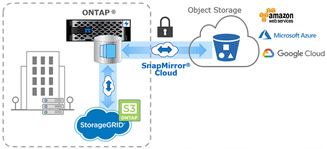

= SnapMirror雲端備份至物件儲存設備
:allow-uri-read: 
:icons: font
:imagesdir: ../media/

[role="lead"]
_SnapMirror Cloud是一項備份與還原技術、專為ONTAP 想要將資料保護工作流程移轉至雲端的其他使用者所設計。從舊有備份到磁帶架構移轉的組織、可以使用物件儲存設備做為長期資料保留和歸檔的替代儲存庫。SnapMirror Cloud提供ONTAP對物件儲存複寫功能、做為永久性遞增備份策略的一部分。

SnapMirror Cloud是ONTAP 以支援SnapMirror複寫技術系列的名義推出、雖然SnapMirror經常用於ONTAP對ONTAP備份、但SnapMirror Cloud使用相同的複寫引擎、將Snapshot複本傳輸ONTAP 至S3相容的物件儲存備份。

SnapMirror Cloud專為備份使用案例而設計、可同時支援長期保留與歸檔工作流程。與SnapMirror一樣、初始SnapMirror Cloud備份會執行磁碟區的基礎傳輸。對於後續備份、SnapMirror Cloud會產生來源磁碟區的快照複本、並只將變更的資料區塊傳輸到物件儲存目標。

SnapMirror Cloud關係可在ONTAP 支援內部部署和公有雲物件儲存目標的各個系統之間設定、包括AWS S3、Google Cloud Storage Platform和Microsoft Azure Blob Storage。其他內部部署物件儲存目標包括StoragGRID和ONTAP SS3。

SnapMirror Cloud複寫是獲授權ONTAP 的功能、需要經過核准的應用程式來協調資料保護工作流程。有多種協調選項可供管理SnapMirror雲端備份：

* 提供SnapMirror Cloud複寫支援的多個協力廠商備份合作夥伴。參與廠商可在上取得 xref:https://www.netapp.com/blog/new-backup-architecture-snapdiff-v3/[NetApp部落格]。
* 適用於ONTAP NetApp原生的解決方案、適用於各種環境的BlueXP與Cloud Backup
* API可用於開發自訂的資料保護工作流程軟體、或是運用自動化工具

