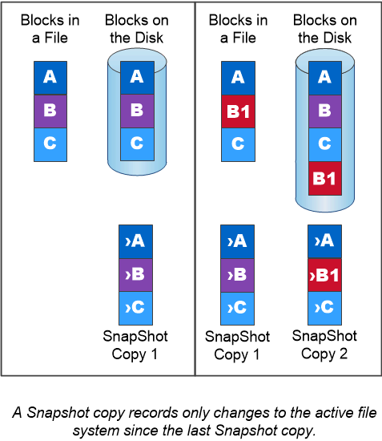

= Snapshot複本
:allow-uri-read: 
:icons: font
:imagesdir: ../media/

[role="lead"]
傳統上、功能完善的複寫技術可滿足災難恢復（DR）和資料歸檔的需求。ONTAP隨著雲端服務的問世、ONTAP NetApp Data Fabric中的端點之間的資料傳輸功能已經過調整、因此可進行此功能的不中斷複寫。所有這些用途的基礎都是ONTAP 「無盡快照」技術。

Snapshot COPY_是磁碟區的唯讀時間點映像。建立 Snapshot 複本之後、作用中的檔案系統和 Snapshot 複本會指向相同的磁碟區塊、因此 Snapshot 複本不會使用額外的磁碟空間。隨著時間的推移、映像會佔用最小的儲存空間、而且效能成本也可忽略不計、因為它只會記錄自上次 Snapshot 複本後檔案的變更。

Snapshot複本的效率歸功於ONTAP的核心儲存虛擬化技術（_Write Anywhere File Layout、WAFL 簡稱「還原」）。WAFL _如同資料庫、使用中繼資料指向磁碟上的實際資料區塊。但是WAFL 、不像資料庫、不像是使用什麼功能來覆寫現有的區塊。它會將更新的資料寫入新的區塊、並變更中繼資料。

Snapshot 複本非常有效率、因為 ONTAP 在建立 Snapshot 複本時會參考中繼資料、而非複製資料區塊。如此一來、其他系統就不再需要「尋找時間」來尋找要複製的區塊、也不需要自行製作複本。

您可以使用Snapshot複本來還原個別檔案或LUN、或還原磁碟區的完整內容。此功能可將Snapshot複本中的指標資訊與磁碟上的資料進行比較、以重建遺失或損壞的物件、而不會造成停機或重大效能成本。ONTAP

_Snapshot原則_定義系統如何建立磁碟區的Snapshot複本。原則會指定何時建立Snapshot複本、保留多少複本、如何命名複本、以及如何標記複寫複本。例如、系統可能會每天在上午12：10建立一個Snapshot複本、保留兩個最新的複本、將其命名為「每日」（附加時間戳記）、並將其標示為「每日」以供複寫。

