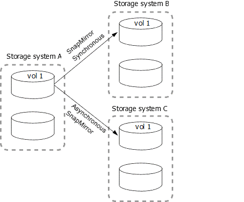

= 橫向和串聯資料保護部署
:allow-uri-read: 
:icons: font
:imagesdir: ../media/

[role="lead"]
您可以使用_fan-Out_部署、將資料保護延伸到多個次要系統。您可以使用_Cascade部署、將資料保護延伸至第三系統。

連出和串聯部署都支援SnapMirror DR、SnapVault SnapMirror或統一化複寫的任何組合；不過、SnapMirror同步關係（從ONTAP 版本9.5開始支援）僅支援一或多個非同步SnapMirror關係的連出部署、不支援串聯部署。只有一種連出組態關係可以是SnapMirror同步關係、來源磁碟區的所有其他關係都必須是非同步SnapMirror關係。 xref:../smbc/smbc_admin_what_happens_during_an_automatic_unplanned_failover.html#resume-protection-in-a-fan-out-configuration-after-failover[SnapMirror營運不中斷] （支援從ONTAP 功能不支援的問題9.8開始）也支援連出組態。

NOTE: 您可以使用_fan-In部署、在多個主要系統和單一次要系統之間建立資料保護關係。每個關係都必須在次要系統上使用不同的磁碟區。

NOTE: 您應該知道、屬於扇出或串聯組態一部分的磁碟區可能需要較長的時間
重新同步。看到 SnapMirror 關係報告並不罕見
長時間內的「準備」狀態。

== 連出部署的運作方式

SnapMirror支援_multier-mirror和_mirror保存庫_的連出部署。

多重鏡射扇出部署是由與多個次要Volume具有鏡射關係的來源Volume所組成。

image::../media/sm-mirror-mirror-fanout.png[資料保護部署：多重鏡射鏡射展開]

鏡射保存庫的扇出部署是由來源磁碟區所組成、該磁碟區與次要磁碟區具有鏡射關係、SnapVault 且與不同次要Volume之間存在不相關性。

image::../media/sm-mirror-vault-fanout.png[資料保護部署：鏡射儲存庫展開]

從Sf2 9.5開始ONTAP 、您可以使用SnapMirror同步關係進行連出部署；不過、連出組態中只有一種關係可以是SnapMirror同步關係、來源Volume的所有其他關係都必須是非同步SnapMirror關係。

== 串聯部署的運作方式

SnapMirror支援_鏡射鏡射_、_鏡射-保存庫_、_資料保存鏡射_和_資料保險箱-保存庫_串聯部署。

鏡射鏡射鏡射串聯部署包含一系列關係、其中來源磁碟區會鏡射至次要磁碟區、而次要磁碟區則會鏡射至第三個磁碟區。如果次要Volume無法使用、您可以在不執行新的基礎傳輸的情況下、同步主要和第三個Volume之間的關係。

從ONTAP 支援SnapMirror 9.6開始、鏡射鏡射串聯部署支援SnapMirror同步關係。只有主要和次要磁碟區可以處於SnapMirror同步關係中。二線磁碟區與三線磁碟區之間的關係必須是非同步的。

image::../media/sm-mirror-mirror-cascade.png[SnapMirror部署：鏡射鏡射鏡射串聯鏈]

鏡射儲存庫串聯部署包含一系列關係、其中來源磁碟區會鏡射至次要磁碟區、而次要磁碟區則會保存至第三個磁碟區。

image::../media/sm-mirror-vault-cascade.png[SnapMirror部署：鏡射資料庫串聯鏈的來源]

也ONTAP 支援資料保存鏡射及從功能性9.2開始的資料保存庫串聯部署：

* 資料保存鏡射串聯部署包含一系列關係、其中來源磁碟區會以資料儲存至次要磁碟區、而次要磁碟區則會鏡射至第三個磁碟區。
* （從ONTAP 版本號9.2開始）保存庫串聯部署包含一系列關係、其中來源Volume會以資料儲存至次要Volume、而次要Volume則會以資料儲存至第三個Volume。

.進一步閱讀
* xref:../smbc/resume-protection-fan-out-configuration.html[使用SM到BC、在連出組態中恢復保護 ]

