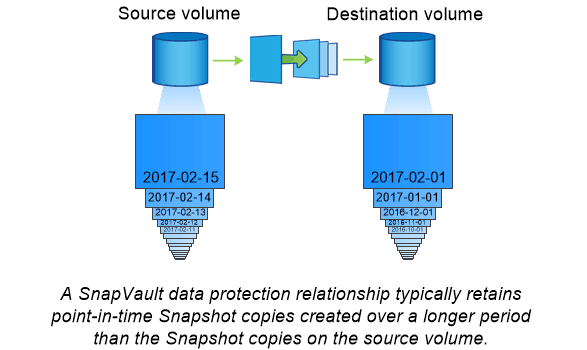

= 使用SnapMirror技術進行資料保存
:allow-uri-read: 
:icons: font
:imagesdir: ../media/

[role="lead"]
SnapMirror保存原則取代SnapVault 了支援支援SnapMirror 9.3及更新版本的功能。ONTAP您可以使用SnapMirror資料庫原則進行磁碟對磁碟Snapshot複製複寫、以符合標準及其他與治理相關的用途。與SnapMirror關係不同的是、目的地通常只包含目前位於來源磁碟區的Snapshot複本、而資料保存目的地通常會保留在更長時間內建立的時間點Snapshot複本。

例如、您可能想要在20年內保留資料的每月Snapshot複本、以符合貴企業的政府會計法規。由於不需要從保存庫儲存設備提供資料、因此您可以在目的地系統上使用速度較慢、成本較低的磁碟。

下圖說明SnapMirror Vault資料保護關係。

== 如何初始化保存資料保護關係

關係的SnapMirror原則定義了基礎的內容和任何更新。

預設資料保險箱原則下的基準傳輸 `XDPDefault` 製作來源 Volume 的 Snapshot 複本、然後將該複本及其參照的資料區塊傳輸至目的地 Volume 。與SnapMirror關係不同的是、資料庫備份不會在基準中包含舊的Snapshot複本。

== 如何更新保存資料保護關係

更新是非同步的、會依照您設定的排程進行。您在關聯原則中定義的規則會識別要納入更新的新Snapshot複本、以及要保留的複本數量。原則中定義的標籤（例如「每月」）必須符合來源上Snapshot原則中定義的一或多個標籤。否則、複寫會失敗。

在的每個更新中 `XDPDefault` 原則： SnapMirror 會傳輸自上次更新後所製作的 Snapshot 複本、前提是它們的標籤必須符合原則規則中定義的標籤。在的下列輸出中 `snapmirror policy show` 的命令 `XDPDefault` 原則請注意下列事項：

* `Create Snapshot` 為 "'false" 、表示這種情況 `XDPDefault` SnapMirror 更新關係時不會建立 Snapshot 複本。
* `XDPDefault` 有「每日」和「每週」的規則、表示當 SnapMirror 更新關係時、會傳輸來源上所有具有相符標籤的 Snapshot 複本。

[listing]
----
cluster_dst::> snapmirror policy show -policy XDPDefault -instance

                     Vserver: vs0
      SnapMirror Policy Name: XDPDefault
      SnapMirror Policy Type: vault
                Policy Owner: cluster-admin
                 Tries Limit: 8
           Transfer Priority: normal
   Ignore accesstime Enabled: false
     Transfer Restartability: always
 Network Compression Enabled: false
             Create Snapshot: false
                     Comment: Default policy for XDP relationships with daily and weekly
                              rules.
       Total Number of Rules: 2
                  Total Keep: 59
                       Rules: SnapMirror Label     Keep  Preserve Warn Schedule Prefix
                              ----------------     ----  -------- ---- -------- ------
                              daily                   7  false       0 -        -
                              weekly                 52  false       0 -        -
----