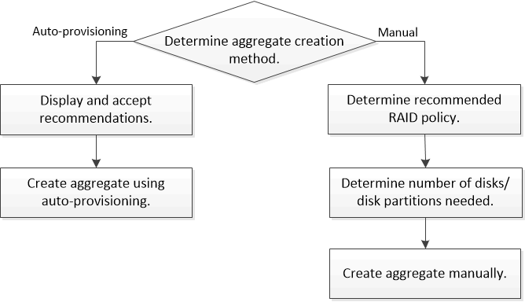

= Aggregate建立工作流程
:allow-uri-read: 
:icons: font
:imagesdir: ../media/

[role="lead"]
建立Aggregate可為系統上的磁碟區提供儲存設備。從ONTAP 功能完善的9.2開始、ONTAP 您可以讓系統推薦使用效能完善的集合體組態（自動資源配置）。如果自動資源配置方法在您的環境中無法使用或不適用、您可以手動設定Aggregate。

