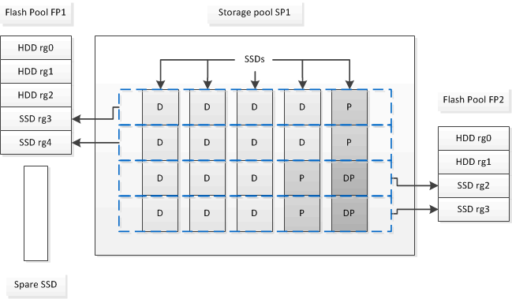

= Flash Pool SSD分割區適用於使用儲存資源池的Flash Pool本機層（Aggregate）
:allow-uri-read: 
:icons: font
:imagesdir: ../media/

[role="lead"]
如果您要提供快取給兩個以上的Flash Pool本機層（Aggregate）、則應該使用Flash Pool固態磁碟機（SSD）分割區。Flash Pool SSD分割區可讓使用Flash Pool的所有本機層共享SSD。如此可將同位元的成本分散於多個本機層、提高SSD快取配置的靈活度、並將SSD效能最大化。

若要在Flash Pool本機層中使用SSD、SSD必須放置在儲存資源池中。您無法在儲存資源池中使用已分割為根資料分割的SSD。將SSD放入儲存資源池之後、SSD就無法再以獨立磁碟的形式進行管理、除非您銷毀與Flash資源池相關的本機層、並銷毀儲存資源池、否則將無法從儲存資源池中移除SSD。

SSD儲存資源池分為四個等量分配單元。新增至儲存資源池的SSD分為四個分割區、四個分配單元各指派一個分割區。儲存資源池中的SSD必須由同一個HA配對擁有。根據預設、HA配對中的每個節點都會指派兩個配置單元。分配單位必須由擁有其所服務之本機層的節點所擁有。如果其中一個節點上的本機層需要更多Flash快取、則可以移轉預設的配置單位數量、以減少一個節點上的數量、並增加合作夥伴節點上的數量。

您可以使用備用SSD來新增至SSD儲存資源池。如果儲存資源池為HA配對中兩個節點所擁有的Flash資源池本機層提供分配單元、則備用SSD可由任一節點擁有。不過、如果儲存資源池僅提供分配單元給HA配對中某個節點所擁有的Flash資源池本機層、則SSD備援磁碟必須由該節點擁有。

下圖為Flash Pool SSD分割區的範例。SSD儲存資源池可將快取提供給兩個Flash Pool本機層：

儲存資源池SP1由五個SSD和一個熱備援SSD組成。其中兩個儲存資源池的分配單元會分配給Flash資源池FP1、兩個則分配給Flash資源池FP2。FP1的快取RAID類型為RAID4。因此、提供給FP1的分配單元僅包含一個指定用於同位元檢查的分割區。FP2的快取RAID類型為RAID-DP。因此、提供給FP2的分配單元包括同位元分割區和雙同位元檢查分割區。

在此範例中、會將兩個配置單元分配給每個Flash Pool本機層。不過、如果某個Flash Pool本機層需要較大的快取、您可以將三個分配單元分配給該Flash Pool本機層、而只將一個分配給另一個層。
