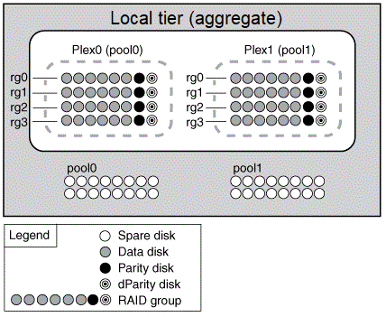

= 鏡射Aggregate的運作方式
:allow-uri-read: 
:icons: font
:imagesdir: ../media/

[role="lead"]
鏡射Aggregate有兩個_plex_（資料複本）、這些複本使用SyncMirror 「畫面」功能來複製資料、以提供備援。

建立鏡射Aggregate（或將第二個叢新增至現有的無鏡射Aggregate）時ONTAP 、將原始叢（plex0）中的資料複製到新叢（plex1）。實體分離的叢集（每個叢集都有自己的RAID群組及其本身的資源池）、並同時更新叢集。如果有更多磁碟故障、而非集合體的RAID層級、則可提供額外的資料遺失保護功能、避免發生連線中斷、因為未受影響的叢會在您修正故障原因時、繼續提供資料。修復有問題的叢之後、兩個叢會重新同步、並重新建立鏡射關係。

系統上的磁碟和陣列LUN分為兩個集區：Pool0和Pool1。Plex0從Pool0取得其儲存設備、而plex1則從Pool1取得其儲存設備。

下圖顯示已SyncMirror 啟用及實作「支援功能」的磁碟集合體。已為Aggregate plex1建立第二個叢。plex1中的資料是plex0中的資料複本、RAID群組也相同。32個備用磁碟會配置給Pool0或Pool1、每個集區有16個磁碟。

下圖顯示由陣列LUN組成的集合體、SyncMirror 其中啟用並實作了各種功能。已為Aggregate plex1建立第二個叢。Plex1是plex0的複本、RAID群組也相同。

image::../media/mirrored-aggregate-with-array-luns.gif[此圖表以上述文字說明。]
