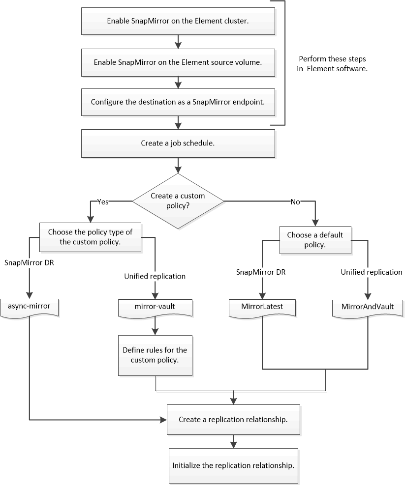

= 元素與ONTAP 元素之間的複寫工作流程
:allow-uri-read: 
:icons: font
:imagesdir: ../media/

[role="lead"]
無論您是要將資料從元素複製到ONTAP 靜態或ONTAP 從靜態複製到元素、都必須設定工作排程、指定原則、以及建立及初始化關係。您可以使用預設或自訂原則。

工作流程假設您已完成中所列的必要工作 xref:index.adoc#prerequisites[先決條件]。如需SnapMirror原則的完整背景資訊、包括使用何種原則的指引、請參閱 link:../data-protection/index.html["資料保護"]。

