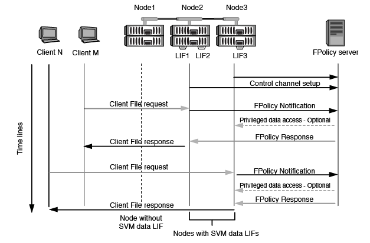

= 節點對外部FPolicy伺服器的通訊程序為何
:allow-uri-read: 
:icons: font
:imagesdir: ../media/

[role="lead"]
若要正確規劃FPolicy組態、您應該瞭解節點對外部FPolicy伺服器的通訊程序為何。

每個參與每個儲存虛擬機器（SVM）的節點、都會使用TCP/IP來啟動與外部FPolicy伺服器（FPolicy伺服器）的連線。與FPolicy伺服器的連線是使用節點資料LIF設定、因此只有當節點具有SVM的作業資料LIF時、參與的節點才能設定連線。

啟用原則時、參與節點上的每個FPolicy程序都會嘗試建立與FPolicy伺服器的連線。它使用原則組態中指定的FPolicy外部引擎IP位址和連接埠。

此連線會透過資料LIF、從每個SVM上的每個節點建立一個控制通道、以連接至FPolicy伺服器。此外、如果同一個參與節點上有IPV4和IPV6資料LIF位址、FPolicy會嘗試建立連線、以便同時連線至IPV4和IPV6。因此、在SVM延伸到多個節點上的案例中、或是同時存在IPV4和IPV6位址時、FPolicy伺服器必須在SVM上啟用FPolicy原則之後、為叢集的多個控制通道設定要求做好準備。

例如、如果叢集有三個節點（節點1、節點2和節點3）、而SVM資料LIF僅散佈於節點2和節點3、則控制通道只會從節點2和節點3啟動、無論資料磁碟區的分佈為何。說明Node2有兩個屬於SVM的資料生命期、分別是LIF1和LIF2、而且初始連線來自於LIF1。如果LIF1失敗、FPolicy會嘗試從LIF2建立控制通道。

== FPolicy如何在LIF移轉或容錯移轉期間管理外部通訊

資料生命期可移轉至同一個節點的資料連接埠、或移轉至遠端節點的資料連接埠。

當資料LIF容錯移轉或移轉時、會建立新的控制通道連線至FPolicy伺服器。然後FPolicy可以重試逾時的SMB和NFS用戶端要求、並將新通知傳送至外部FPolicy伺服器。節點會拒絕FPolicy伺服器對原始、逾時SMB和NFS要求的回應。

== FPolicy如何在節點容錯移轉期間管理外部通訊

如果裝載用於FPolicy通訊之資料連接埠的叢集節點故障、ONTAP 則無法中斷FPolicy伺服器與節點之間的連線。

設定LIF管理程式、將FPolicy通訊中使用的資料連接埠移轉至另一個作用中節點、即可減輕叢集容錯移轉至FPolicy伺服器的影響。移轉完成後、會使用新的資料連接埠建立新的連線。

如果未設定LIF管理程式來移轉資料連接埠、則FPolicy伺服器必須等待故障節點啟動。節點啟動後、會使用新的工作階段ID從該節點啟動新的連線。

[NOTE]
====
FPolicy伺服器會使用「保持作用中」傳輸協定訊息來偵測中斷的連線。清除工作階段ID的逾時是在設定FPolicy時決定。預設的「保持作用中」逾時為兩分鐘。

====