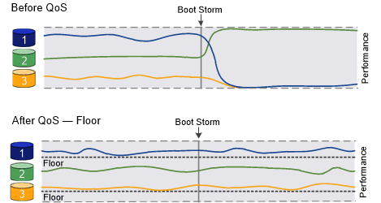

= 透過 QoS 總覽來保證處理量
:allow-uri-read: 
:icons: font
:imagesdir: ../media/

[role="lead"]
您可以使用儲存服務品質（QoS）來保證關鍵工作負載的效能不會因競爭工作負載而降級。您可以在競爭的工作負載上設定處理量上限、以限制其對系統資源的影響、或為關鍵工作負載設定處理量下限、以確保其符合最低處理量目標、無論競爭的工作負載有何需求。您甚至可以針對相同的工作負載設定上限和樓層。

== 關於處理量上限（QoS上限）

處理量上限會將工作負載的處理量限制為最大IOPS或Mbps、或IOPS和Mbps。在下圖中、工作負載2的處理量上限可確保工作負載1和3不會「凸起」。

_原則群組_定義一或多個工作負載的處理量上限。工作負載代表_storage物件的I/O作業：_磁碟區、檔案、qtree或LUN、或SVM中的所有磁碟區、檔案、qtree或LUN。您可以在建立原則群組時指定上限、也可以等到監控工作負載之後再指定上限。

[NOTE]
====
工作負載的處理量可能超過指定上限10%、尤其是當工作負載處理量發生快速變化時。處理突發的上限可能超過50%。當權杖累積率高達150%時、單一節點上就會發生突發事件

====
image::../media/qos-ceiling.gif[QoS上限]

== 關於處理量層（QoS下限）

處理量層級可確保工作負載的處理量不會低於最低IOPS或Mbps、或IOPS和Mbps。下圖中、工作負載1和工作負載3的處理量層級可確保符合最低處理量目標、無論工作負載2的需求為何。

[TIP]
====
如範例所示、處理量上限會直接調節處理量。處理量最低層會間接調節處理量、將已設定最低層的工作負載設為優先順序。

====
定義處理量層的原則群組無法套用至SVM。您可以在建立原則群組時指定樓層、也可以等到監控工作負載之後再指定樓層。

[NOTE]
====
在更新於ONTAP VMware版本9.7之前的版本中、當有足夠的可用效能容量時、就能保證處理量的樓層數。在VMware 9.7及更新版本中、即使可用的效能容量不足、也能保證處理量的樓層數。ONTAP這種新的樓層行為稱為Floor v2。為了達成保證、第v2層級可能會導致工作負載延遲更高、而不會出現處理量層或工作環境超過場地設定的情況。第v2層同時適用於QoS和調適性QoS。啟用/停用Floor v2新行為的選項、可在ONTAP 更新版本的更新版本中找到。在執行「Volume Move tog-tover」等關鍵作業時、工作負載可能會落在指定樓層以下。即使有足夠的可用容量且未執行關鍵作業、工作負載的處理量仍可能低於指定樓層達5%。如果場地配置過度、而且沒有效能容量、則部分工作負載可能會落在指定樓層以下。

====

== 關於共享和非共享的QoS原則群組

從ONTAP S得9.4開始、您可以使用非共享的QoS原則群組、來指定定義的處理量上限或樓層分別套用至每個成員工作負載。共享原則群組的行為取決於原則類型：

* 對於處理量上限、指派給共用原則群組的工作負載總處理量不得超過指定上限。
* 對於處理量層、共用原則群組只能套用至單一工作負載。

== 關於調適性QoS

通常、您指派給儲存物件的原則群組值會固定。當儲存物件大小變更時、您需要手動變更值。例如、增加磁碟區上使用的空間量、通常需要為磁碟區指定的處理量上限相應增加。

_Adaptive QoS_會自動將原則群組值調整為工作負載大小、並隨著工作負載大小的變更、維持IOPS與TBs的比率。當您在大型部署中管理數百或數千個工作負載時、這是一項重大優勢。

您通常會使用調適性QoS來調整處理量上限、但也可以使用它來管理處理量層（當工作負載大小增加時）。工作負載大小是以儲存物件的已配置空間或儲存物件所使用的空間表示。

[NOTE]
====
在ONTAP 更新版本的更新版本中、可在處理量層使用已用的空間。不支援ONTAP 使用於效能不符合更新版本的資料層。

====
* _allocated space_原則會根據儲存物件的名義大小、維持IOPS/TB|GB比率。如果比率為100 IOPS/GB、則150 GB的磁碟區只要磁碟區維持該大小、就會有15,000 IOPS的處理量上限。如果磁碟區大小調整為300 GB、調適性QoS會將處理量上限調整為30、000 IOPS。
* _used space_原則（預設值）會根據儲存效率前的實際資料量、維持IOPS/TB|GB比率。如果比率為100 IOPS/GB、則儲存100 GB資料的150 GB磁碟區的處理量上限為10、000 IOPS。隨著使用空間量的變化、調適性QoS會根據比率調整處理量上限。

從功能支援的9.5開始ONTAP 、您可以為應用程式指定I/O區塊大小、以IOPS和Mbps來表示處理量限制。MBps限制是根據區塊大小乘以IOPS限制計算而得。例如、IOPS限制為6144IOPS/TB的I/O區塊大小為32K、會產生192 MBps的Mbps限制。

處理量上限和樓層的行為如下：

* 當工作負載指派給調適性QoS原則群組時、上限或樓層會立即更新。
* 調整調適性QoS原則群組中的工作負載大小時、上限或樓層大約會在五分鐘內更新。

在進行更新之前、處理量必須增加至少10 IOPS。

調適性QoS原則群組永遠不會共用：定義的處理量上限或樓層會個別套用至每個成員的工作負載。

從ONTAP 推出支援速度僅9.6的功能開始、ONTAP Select 固態硬碟可支援速度不受速度需求的高效能地板。

== 一般支援

下表顯示支援處理量上限、處理量層和調適性QoS的差異。

|===

| 資源或功能 | 處理量上限 | 處理量最低 | 處理量層v2 | 調適性QoS 

 a| 
版本9 ONTAP
 a| 
全部
 a| 
9.2及更新版本
 a| 
9.7及更新版本
 a| 
9.3及更新版本

 a| 
平台
 a| 
全部
 a| 
* AFF
* C190 *
* 採用SSD *的高階版ONTAP Select

 a| 
* AFF
* C190
* 搭載SSD的高階版ONTAP Select

 a| 
全部

 a| 
通訊協定
 a| 
全部
 a| 
全部
 a| 
全部
 a| 
全部

 a| 
FabricPool
 a| 
是的
 a| 
是的、如果分層原則設定為「無」、而且雲端中沒有區塊。
 a| 
是的、如果分層原則設定為「無」、而且雲端中沒有區塊。
 a| 
是的

 a| 
SnapMirror同步
 a| 
是的
 a| 
否
 a| 
否
 a| 
是的

|===
* C190與ONTAP Select 支援功能從ONTAP 發行版的《The》（《The》）中開始。

== 處理量上限支援的工作負載

下表顯示ONTAP 支援各個版本的工作負載、以支援不同版本的處理量上限。不支援根磁碟區、負載共用鏡像和資料保護鏡像。

|===

| 工作負載支援-上限 | 9.0 | 9.1 | 9.2 | 9.3 | 9.4及更新版本 | 9.8及更新版本 

 a| 
Volume
 a| 
是的
 a| 
是的
 a| 
是的
 a| 
是的
 a| 
是的
 a| 
是的

 a| 
檔案
 a| 
是的
 a| 
是的
 a| 
是的
 a| 
是的
 a| 
是的
 a| 
是的

 a| 
LUN
 a| 
是的
 a| 
是的
 a| 
是的
 a| 
是的
 a| 
是的
 a| 
是的

 a| 
SVM
 a| 
是的
 a| 
是的
 a| 
是的
 a| 
是的
 a| 
是的
 a| 
是的

 a| 
流通量FlexGroup
 a| 
否
 a| 
否
 a| 
否
 a| 
是的
 a| 
是的
 a| 
是的

 a| 
qtree *
 a| 
否
 a| 
否
 a| 
否
 a| 
否
 a| 
否
 a| 
是的

 a| 
每個原則群組有多個工作負載
 a| 
是的
 a| 
是的
 a| 
是的
 a| 
是的
 a| 
是的
 a| 
是的

 a| 
非共用原則群組
 a| 
否
 a| 
否
 a| 
否
 a| 
否
 a| 
是的
 a| 
是的

|===
*從ONTAP 支援支援支援支援NFS的功能、從支援支援支援NFS的功能FlexVol 、到支援支援支援支援的FlexGroup 功能、從功能性的功能到功能性的功能。從ONTAP 推出支援SMB的支援範圍起、FlexVol 從推出支援SMB的功能、即可從功能支援功能支援使用功能的功能性功能、從功能性功能表中的qtree和FlexGroup 功能表中、存取SMB。

== 處理量層的支援工作負載

下表顯示ONTAP 支援各個版本之資料中心的工作負載。不支援根磁碟區、負載共用鏡像和資料保護鏡像。

|===

| 工作負載支援- Floor | 9.2 | 9.3 | 9.4及更新版本 | 9.8及更新版本 

 a| 
Volume
 a| 
是的
 a| 
是的
 a| 
是的
 a| 
是的

 a| 
檔案
 a| 
否
 a| 
是的
 a| 
是的
 a| 
是的

 a| 
LUN
 a| 
是的
 a| 
是的
 a| 
是的
 a| 
是的

 a| 
SVM
 a| 
否
 a| 
否
 a| 
否
 a| 
否

 a| 
流通量FlexGroup
 a| 
否
 a| 
否
 a| 
是的
 a| 
是的

 a| 
qtree *
 a| 
否
 a| 
否
 a| 
否
 a| 
是的

 a| 
每個原則群組有多個工作負載
 a| 
否
 a| 
否
 a| 
是的
 a| 
是的

 a| 
非共用原則群組
 a| 
否
 a| 
否
 a| 
是的
 a| 
是的

|===
*從ONTAP 支援支援支援支援NFS的功能、從支援支援支援NFS的功能FlexVol 、到支援支援支援支援的FlexGroup 功能、從功能性的功能到功能性的功能。從ONTAP 推出支援SMB的支援範圍起、FlexVol 從推出支援SMB的功能、即可從功能支援功能支援使用功能的功能性功能、從功能性功能表中的qtree和FlexGroup 功能表中、存取SMB。

== 支援調適性QoS的工作負載

下表顯示ONTAP 支援各更新版本的調適性QoS的工作負載。不支援根磁碟區、負載共用鏡像和資料保護鏡像。

|===

| 工作負載支援：調適性QoS | 9.3 | 9.4及更新版本 

 a| 
Volume
 a| 
是的
 a| 
是的

 a| 
檔案
 a| 
否
 a| 
是的

 a| 
LUN
 a| 
否
 a| 
是的

 a| 
SVM
 a| 
否
 a| 
否

 a| 
流通量FlexGroup
 a| 
否
 a| 
是的

 a| 
每個原則群組有多個工作負載
 a| 
是的
 a| 
是的

 a| 
非共用原則群組
 a| 
是的
 a| 
是的

|===

== 工作負載和原則群組的最大數量

下表顯示ONTAP 各個版本的工作負載和原則群組數量上限。

|===

| 工作負載支援 | 9.3及更早版本 | 9.4及更新版本 

 a| 
每個叢集的工作負載上限
 a| 
12、000
 a| 
40、000

 a| 
每個節點的工作負載上限
 a| 
12、000
 a| 
40、000

 a| 
原則群組上限
 a| 
12、000
 a| 
12、000

|===