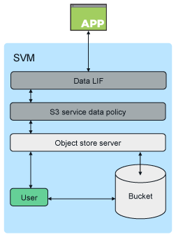

= 架構
:allow-uri-read: 
:icons: font
:imagesdir: ../media/

[role="lead"]
在 ONTAP 中、貯體的基礎架構是 link:../flexgroup/definition-concept.html["流通量FlexGroup"]、這是由多個組成成員磁碟區組成、但以單一磁碟區管理的單一命名空間。

image::../media/fg-overview-s3-config.gif[以一組稱為「成員」的不全功能資料區表示的資料量FlexGroup FlexVol]

透過授權使用者和用戶端應用程式、即可存取儲存庫。

[NOTE]
====
當儲存區僅用於 S3 應用程式（包括用作 FabricPool 端點）時、基礎 FlexGroup Volume 僅支援 S3 傳輸協定。

從 ONTAP 9.12.1 開始、 S3 傳輸協定也可以在中啟用、而 S3 link:../s3-multiprotocol/index.html["多重傳輸協定 NAS 磁碟區"] 傳輸協定已預先設定為使用 NAS 傳輸協定。在多重傳輸協定 NAS 磁碟區中啟用 S3 傳輸協定時、用戶端應用程式可以使用 NFS 、 SMB 和 S3 來讀寫資料。

====

== 貯體限制

最小貯體大小為 95GB 。+ 最大鏟斗尺寸限制為 FlexGroup 最大尺寸 60PB 。

每個 FlexGroup 磁碟區最多可有 1000 個貯體、每個叢集最多可有 12,000 個貯體（使用 12 個 FlexGroup 磁碟區）。

== 使用 ONTAP 9.14.1 及更新版本自動調整 FlexGroup 規模

從 ONTAP 9.14.1 開始、預設的 FlexGroup 大小是根據基礎儲存區的大小而定。FlexGroup Volume 會隨著貯體的新增或移除而自動增加或縮小。

例如、如果初始 Bucket_A 的資源配置為 100GB 、則 FlexGroup 將會精簡配置為 100GB 。如果另外建立兩個儲存區、儲存容量為 300 GB 的 Bucket_B 、以及容量為 500 GB 的 Bucket_C 、則 FlexGroup 磁碟區將成長至 900 GB 。

（ 100GB 的 Bucket_A + 300GB 的 Bucket_B + 500GB 的 Bucket_C = 900GB ）。

如果刪除 Bucket_A 、基礎 FlexGroup 磁碟區將縮減至 800GB 。

== ONTAP 9.13.1 及更早版本中的固定預設 FlexGroup 大小

為了提供貯體擴充的容量、 FlexGroup Volume 上所有貯體的總使用容量應小於叢集上可用儲存集合體的 FlexGroup 磁碟區容量上限 33% 。如果無法達成此目標、則所建立的新貯體將配置在新的自動建立 FlexGroup Volume 上。

在 ONTAP 9.14.1 之前、 FlexGroup 大小會根據其環境固定為預設大小：

* ONTAP 中的 1.6PB
* ONTAP Select 中的 100TB

如果叢集沒有足夠的容量來配置預設大小的 FlexGroup Volume 、 ONTAP 會將預設大小減半、直到在現有環境中進行佈建為止。

例如、在 300TB 環境中、 FlexGroup Volume 會自動配置為 200TB （ 1.6PB 、 800TB 和 400TB FlexGroup 磁碟區對於環境而言太大）。
