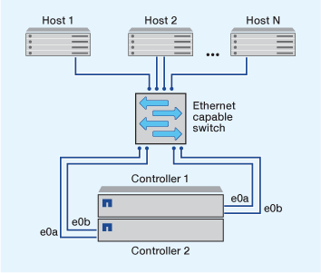
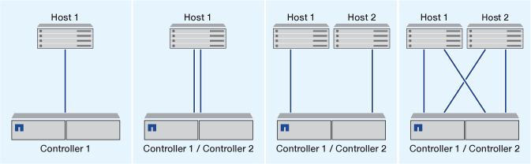

= 設定 iSCSI SAN 主機的方法
:allow-uri-read: 
:icons: font
:imagesdir: ../media/

[role="lead"]
您應該使用高可用度（ HA ）配對來設定 iSCSI 組態、這些配對可直接連接到 iSCSI SAN 主機、或透過一或多個 IP 交換器連接到主機。

link:../concepts/high-availability-pairs-concept.html["HA 配對"] 定義為主動 / 最佳化路徑的報告節點、以及主機用來存取 LUN 的主動 / 未最佳化路徑。使用不同作業系統（例如 Windows 、 Linux 或 UNIX ）的多部主機、可以同時存取儲存設備。  主機需要安裝及設定支援 ALUA 的多重路徑解決方案。可在上驗證支援的作業系統和多重路徑解決方案 link:https://mysupport.netapp.com/matrix["NetApp 互通性對照表工具"^]。

在多網路組態中、有兩個以上的交換器會將主機連線至儲存系統。  建議使用多網路組態、因為它們完全備援。  在單一網路組態中、有一台交換器會將主機連線至儲存系統。  單一網路組態並非完全備援。

[NOTE]
====
link:../system-admin/single-node-clusters.html["單節點組態"] 不建議使用、因為它們不提供支援容錯和不中斷營運所需的備援功能。

====
.相關資訊
* 瞭解方法 link:../san-admin/selective-lun-map-concept.html#determine-whether-slm-is-enabled-on-a-lun-map["選擇性 LUN 對應（ SLM ）"] 限制用於存取 HA 配對所擁有 LUN 的路徑。
* 深入瞭解 link:../san-admin/manage-lifs-all-san-protocols-concept.html["SAN LIF"]。
* 深入瞭解 link:../san-config/benefits-vlans-iscsi-concept.html["iSCSI 中 VLAN 的優點"]。

== 多網路 iSCSI 組態

在多網路HA配對組組態中、兩個或多個交換器會將HA配對連接至一或多個主機。由於有多個交換器、因此此組態完全備援。

== 單一網路 iSCSI 組態

在單一網路HA配對組組態中、一台交換器會將HA配對連接至一或多個主機。由於只有一台交換器、因此此組態並未完全備援。

== 直接附加 iSCSI 組態

在直接附加的組態中、一或多個主機會直接連線至控制器。

