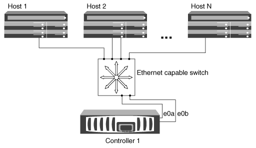

= 使用單一節點設定iSCSI SAN主機的方法
:allow-uri-read: 
:icons: font
:imagesdir: ../media/

[role="lead"]
您可以將iSCSI SAN主機設定為直接連線至單一節點、或使用一或多個IP交換器。您應該決定是要使用非完全備援的單一交換器組態、還是要使用完全備援的多重交換器組態。

您可以在直接附加、單一交換器或多重交換器環境中設定iSCSI SAN主機。如果有多個主機連線至節點、則每個主機都可以設定不同的作業系統。對於單一和多重網路組態、節點可與交換器建立多個iSCSI連線、但需要支援ALUA的多重路徑軟體。

[NOTE]
====
如果從主機到控制器有多個路徑、則必須在主機上啟用ALUA。

====

== 直接附加的單節點組態

在直接附加的組態中、一或多個主機會直接連線至節點。

image::../media/scrn_en_drw_fc-302020-direct-sing-on.png[直接連接控制器的圖表、其中有一或多個主機直接連接至節點]

== 單一網路單節點組態

在單一網路單節點組態中、一台交換器會將單一節點連接至一或多個主機。由於只有一台交換器、因此此組態並未完全備援。

== 多網路單節點組態

在多網路單節點組態中、兩個或多個交換器會將單一節點連接至一或多個主機。由於有多個交換器、因此此組態完全備援。

image::../media/scrn-en-drw-iscsi-multinw-singlen.gif[多網路單一節點組態]
