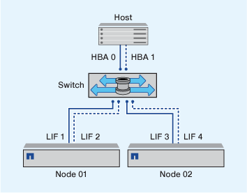

= 單一網路分區
:allow-uri-read: 
:icons: font
:imagesdir: ../media/

[role="lead"]
在單一架構組態中、您仍可將每個主機啟動器連接至每個儲存節點。主機需要多重路徑軟體來管理多個路徑。每個主機都應該有兩個用於多重路徑的啟動器、以便在解決方案中提供恢復能力。

每個啟動器至少應有一個LIF（從啟動器可以存取的每個節點）。分區應至少允許一條路徑從主機啟動器到叢集中的HA節點配對、以提供LUN連線的路徑。這表示主機上的每個啟動器在其區域組態中、每個節點可能只有一個目標LIF。如果叢集中的同一個節點或多個節點需要多重路徑、則每個節點在其區域組態中都會有多個生命區。如此一來、當節點故障或包含LUN的磁碟區移至不同節點時、主機仍可存取其LUN。這也需要適當設定報告節點。

支援單一架構組態、但不視為高可用度。單一元件故障可能導致資料存取中斷。

在下圖中、主機有兩個啟動器、並執行多重路徑軟體。共有兩個區域：

[NOTE]
====
本圖所使用的命名慣例只是一項建議、您可以選擇使用其中一種命名慣例來搭配ONTAP 您的解決方案。

====
* 區域1：HBA 0、LIF_1和LIF_3
* 區域 2 ： HBA 1 、 LIF_2 和 LIF_4

如果組態包含更多節點、則這些區域中會包含額外節點的lifs。

在此範例中、您也可以在每個區域中擁有全部四個生命區。在這種情況下、區域如下：

* 區域1：HBA 0、LIF_1、LIF_2、LIF_3和LIF_4
* 區域 2 ： HBA 1 、 LIF_1 、 LIF_2 、 LIF_3 和 LIF_4

[NOTE]
====
主機作業系統和多重路徑軟體必須支援用於存取節點上LUN的支援路徑數量。若要判斷用於存取節點上LUN的路徑數目、請參閱SAN組態限制一節。

====
.相關資訊
https://hwu.netapp.com["NetApp Hardware Universe"^]
