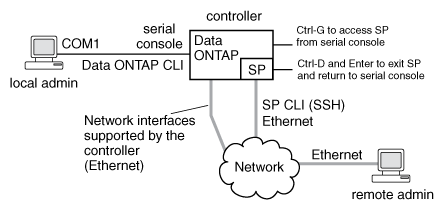

= 關於SP
:allow-uri-read: 
:icons: font
:imagesdir: ../media/

[role="lead"]
服務處理器（SP）是遠端管理裝置、可讓您從遠端存取、監控及疑難排解節點。

SP的主要功能包括：

* SP可讓您從遠端存取節點、以診斷、關機、重新開機或重新開機節點、無論節點控制器的狀態為何。
+
SP由待命電壓供電、只要節點至少有一個電源供應器有輸入電力、就能使用此電壓。

+
您可以從管理主機使用Secure Shell用戶端應用程式登入SP。然後、您可以使用SP CLI遠端監控節點並進行疑難排解。此外、您也可以使用SP存取序列主控台、ONTAP 並從遠端執行各種指令。

+
您可以從序列主控台存取SP、或從SP存取序列主控台。SP可讓您同時開啟SP CLI工作階段和獨立的主控台工作階段。

+
例如、當溫度感測器嚴重偏高或偏低時ONTAP 、會觸發SP正常關閉主機板。序列主控台沒有回應、但您仍可在主控台按Ctrl-G存取SP CLI。然後、您可以使用SP的「系統開機」或「系統關機後再開機」命令來開機或關機後再開啟節點。

* SP會監控環境感測器並記錄事件、協助您及時採取有效的服務行動。
+
SP會監控環境感測器、例如節點溫度、電壓、電流和風扇速度。當環境感測器達到異常狀況時、SP會記錄異常讀數、通知ONTAP 問題、並透過AutoSupport 消息傳送必要的警示和「自有系統」通知、無論節點是否能傳送AutoSupport 不正常訊息。

+
SP也會記錄開機進度、現場可更換單元（FRU）變更、ONTAP 由支援中心產生的事件、以及SP命令記錄等事件。您可以手動叫用AutoSupport 一個消息、以包含從指定節點收集的SP記錄檔。

+
除了代表當機節點產生這些訊息、並將額外的診斷資訊附加到AutoSupport 消息中之外、SP也不會影響AutoSupport 到功能性。此功能會從無法恢復的功能中繼承整個功能。AutoSupport ONTAP

+
[NOTE]
====
SP並不仰賴「系統節點AutoSupport 」命令的「傳輸」參數設定來傳送通知。SP僅使用簡易郵件傳輸傳輸傳輸傳輸傳輸傳輸協定（Simple Mail Transport Protocol、簡稱SMTP）、並要求主機AutoSupport 的整套組態包含郵件主機資訊。

====
+
如果啟用SNMP、SP會針對所有「自訂系統」事件、產生SNMP設陷主機的SNMP設陷。

* SP具有非揮發性記憶體緩衝區、可在系統事件記錄（SEel）中儲存多達4、000個事件、協助您診斷問題。
+
該系統會將每個稽核記錄項目儲存為稽核事件。儲存在SP的內建快閃記憶體中。SP會透過AutoSupport 一則消息、自動將來自該系統的事件清單傳送給指定的收件者。

+
該系統事件日誌包含下列資訊：

+
** SP偵測到的硬體事件、例如電源供應器、電壓或其他元件的感應器狀態
** SP偵測到的錯誤-例如通訊錯誤、風扇故障或記憶體或CPU錯誤
** 由節點傳送至SP的關鍵軟體事件、例如發生緊急狀況、通訊故障、開機故障、或使用者觸發的「系統停機」、因為發出SP「系統重設」或「系統關機循環」命令

* 無論系統管理員是登入或連線至主控台、SP都會監控序列主控台。
+
當訊息傳送至主控台時、SP會將訊息儲存在主控台記錄中。只要SP有來自任一節點電源供應器的電力、主控台記錄就會持續存在。由於SP是以待命電源運作、因此即使節點已關機或關機、仍可繼續使用。

* 如果已設定SP、則可使用硬體輔助接管。
* SP API服務可透過ONTAP 網路與SP進行通訊。
+
此服務可ONTAP 支援網路型功能、例如使用網路介面進行SP韌體更新、讓節點存取另一個節點的SP功能或系統主控台、以及從另一個節點上傳SP記錄、藉此強化SP的支援功能。

+
您可以變更服務使用的連接埠、續訂服務用於內部通訊的SSL和SSH憑證、或完全停用服務、藉此修改SP API服務的組態。

下圖說明ONTAP 如何存取節點的ENetApp和SP。SP介面可透過乙太網路連接埠存取（以機箱背面的扳手圖示表示）：

