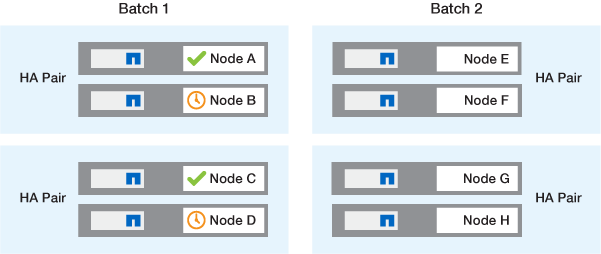

= ONTAP 軟體升級方法
:allow-uri-read: 
:icons: font
:imagesdir: ../media/

[role="lead"]
您可以使用系統管理來執行 ONTAP 軟體的自動升級。或者、您也可以使用 ONTAP 命令列介面（ CLI ）執行自動或手動升級。升級 ONTAP 的方法取決於您的組態、目前的 ONTAP 版本、以及叢集中的節點數量。NetApp 建議您使用系統管理員來執行自動升級、除非您的組態需要不同的方法。例如、如果您的 MetroCluster 組態有 4 個節點執行 ONTAP 9.3 或更新版本、則應該使用系統管理員來執行自動升級（有時稱為自動不中斷升級或 andu ）。如果您的 MetroCluster 組態有 8 個節點執行 ONTAP 9.2 或更早版本、則應使用 CLI 執行手動升級。

您可以使用循環升級程序或批次升級程序來執行升級。兩者皆不中斷營運。

對於自動升級、 ONTAP 會自動在每個節點上安裝目標 ONTAP 映像、驗證叢集元件、確保叢集可以不中斷地升級、然後根據節點數量在背景執行批次或滾動升級。對於手動升級、管理員會手動確認叢集中的每個節點都已準備好進行升級、然後執行步驟來執行循環升級。

.ONTAP 滾動升級
對於節點少於 8 個的叢集而言、循環升級程序是預設程序。  在循環升級程序中、節點會離線並升級、而其合作夥伴則會接管其儲存設備。當節點升級完成時、合作夥伴節點會將控制權交回原始擁有節點、並在合作夥伴節點上重複此程序。每個額外的HA配對都會依序升級、直到所有HA配對都執行目標版本為止。

.ONTAP 批次升級
批次升級程序是 8 個以上節點叢集的預設程序。  在批次升級程序中、叢集分為兩批。  每個批次都包含多個 HA 配對。在第一批中、每個 HA 配對的第一個節點會與批次中所有其他 HA 配對的第一個節點同時升級。

在以下範例中、每個批次中有兩個 HA 配對。  批次升級開始時、節點 A 和節點 C 會同時升級。

image::../media/batch_upgrade_set_1_ieops-1607.png[批次升級步驟 1]

每個 HA 配對的第一個節點升級完成後、批次 1 中的合作夥伴節點會同時升級。

在以下範例中、節點 A 和節點 C 升級之後、節點 B 和節點 D 會同時升級。

接著會針對批次 2 中的節點重複此程序；每個 HA 配對的第一個節點會與批次中所有其他 HA 配對的第一個節點同時升級。

在以下範例中、節點 E 和節點 G 會同時升級。

image::../media/batch_upgrade_set_3_ieops-1612.png[批次升級步驟 3]

每個 HA 配對的第一個節點升級完成後、批次 2 中的合作夥伴節點會同時升級。

在下列範例中、節點 F 和節點 H 會同時升級、以完成批次升級程序。

image::../media/batch_upgrade_set_4_ieops-1620.png[批次升級步驟 4]

== 根據組態建議的 ONTAP 升級方法

您的組態所支援的升級方法會依建議的使用順序列出。

[cols="4"]
|===
| 組態 | 版本ONTAP | 節點數 | 建議的升級方法 

| 標準 | 9.0 或更新版本 | 2 個以上  a| 
* xref:task_upgrade_andu_sm.html[使用System Manager自動不中斷營運]
* xref:task_upgrade_andu_cli.html[使用CLI自動不中斷營運]

| 標準 | 9.0 或更新版本 | 單一 | xref:task_upgrade_disruptive_automated_cli.html[自動化中斷] 

| MetroCluster | 9.3 或更新版本 | 8.  a| 
* xref:task_upgrade_andu_cli.html[使用CLI自動不中斷營運]
* xref:task_updating_a_four_or_eight_node_mcc.html[使用 CLI 手動不中斷 4 或 8 節點 MetroCluster 的運作]

| MetroCluster | 9.3 或更新版本 | 2、4.  a| 
* xref:task_upgrade_andu_sm.html[使用System Manager自動不中斷營運]
* xref:task_upgrade_andu_cli.html[使用CLI自動不中斷營運]

| MetroCluster | 9.2或更早版本 | 4、8. | xref:task_updating_a_four_or_eight_node_mcc.html[使用 CLI 手動不中斷 4 或 8 節點 MetroCluster 的運作] 

| MetroCluster | 9.2或更早版本 | 2. | xref:task_updating_a_two_node_metrocluster_configuration_in_ontap_9_2_and_earlier.html[使用 CLI 手動不中斷 2 節點 MetroCluster 的運作] 
|===
無論組態為何、我們都建議您使用系統管理員進行所有修補程式升級。

NOTE: 答 xref:task_updating_an_ontap_cluster_disruptively.html[手動中斷升級] 可在任何組態上執行。  不過、除非您可以在升級期間讓叢集離線、否則不應執行中斷升級。如果您是在SAN環境中運作、則應準備好在執行中斷升級之前、先關閉或暫停所有SAN用戶端。使用ONTAP 不中斷的CLI執行升級。
